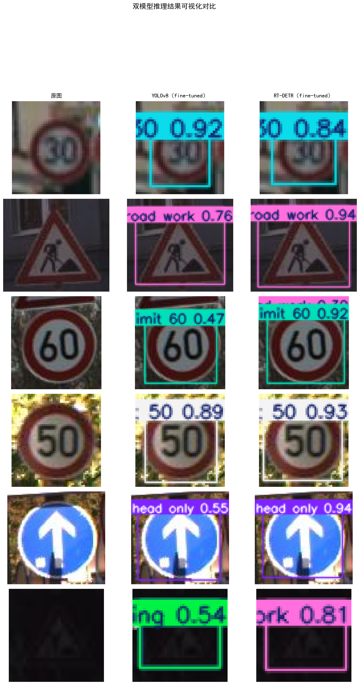
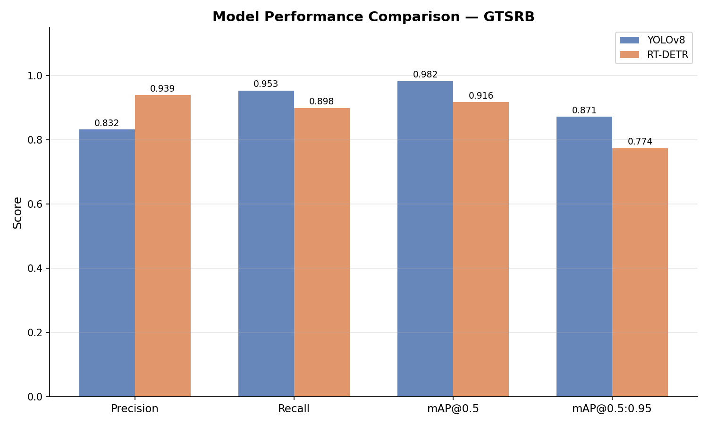
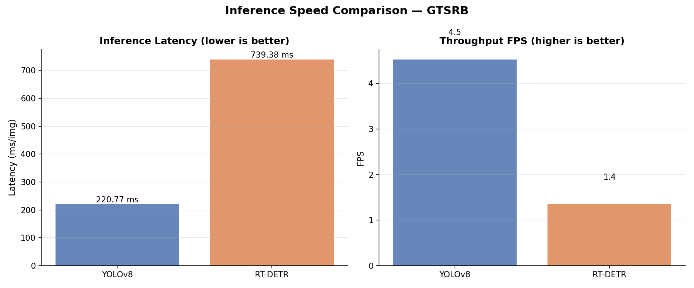

# 🚦 交通标志检测系统 (Traffic Sign Detection System)

本项目是一个基于 **YOLOv8** 和 **RT-DETR** (Real-Time Detection Transformer) 的交通标志实时检测系统。系统不仅具备强大的双模型性能对比与评估能力，还配备了易于使用的交互式 Web 界面，支持本地保存图片上传、图片 URL 直接提取和上传视频文件进行实时逐帧预测。

## 🖼️ 模型对比效果

<div align="center">
  
  <p>图 1：模型检测效果对比</p>
</div>

<div align="center">
  
  <p>图 2：模型性能对比</p>
</div>

<div align="center">
  
  <p>图 3：模型推理速度对比</p>
</div>

## ✨ 核心特性

- **多模型支持与无缝切换**：集成了以 CNN 为基础的 YOLOv8 和以 Transformer 架构为基础的 RT-DETR 两种目标检测架构，方便进行多维度的模型验证、性能对比评估。
- **丰富的输入格式支持**：支持本地上传原始图片检测、直接输入网络公开图片的 URL 链接一键抓取进行检测，以及本地录好视频的推理识别。
- **详尽的模型对比评估**：内部封装了高度自动化的模型验证工具 (`evaluate.py`) 和效果直观对比脚本 (`compare_images.py`)。可以基于 GTSRB 数据集一揽子输入 mAP (平均精度均值)、Precision (精确率)、Recall (召回率)、FPS (推理帧率) 的量化结果指标以及可视化图表。
- **国际化命名架构**：在识别与标签前端展示时全面采用了标准的英文类名 (如 `Speed limit (50km/h)`, `Stop`, `Yield` 等)，保证代码在跨语种协作及二次开发上更为专业合规。
- **傻瓜式部署与轻巧 Web 框架**：整个后台交互与路由采用高度解耦的 Flask 框架体系结合原生 HTML/JS 构建轻量级 Web 推理界面，并提供完善的 `.env` 环境变量支持，调整少量配置即刻部署运行。

## 📂 核心资源与项目结构

```text
traffic-sign-rtdetr/
├── web/                    # 采用 Flask 搭建的核心推理 Web 服务
│   ├── app.py              # Flask Web 应用主要路由入口和模型推理控制
│   ├── static/             # 静态资源处理
│   │   ├── uploads/        # 暂存用户本地上传文件 / URL 下载的抓取文件
│   │   └── results/        # 存放模型预测、渲染之后的图像或视频结果
│   └── templates/
│       ├── index.html      # 系统首页界面视图 (支持选择不同输入模式)
│       └── result.html     # 模型检测结果及详情展示页面
├── scripts/                # 提供自动化模型训练及比对核心支持的核心命令库
│   ├── train.py            # 支持使用 YOLOv8/RT-DETR 模型对指定交通标志训练集的训练支持脚本
│   ├── evaluate.py         # 对已训练出的 YOLOv8 和 RT-DETR 两套模型权重分别进行细化测试集评估对比脚本
│   └── compare_images.py   # 用于生成模型多场景下的同源预测推理并排效果比对测试图
├── data/
│   └── gtsrb.yaml          # 为 GTSRB 数据集量身定制的 YOLO 训练配置映射文件（支持超 43 种不同子类标志格式）
├── yolov8s.pt              # 预训练的 YOLOv8s 通用模型初始化权重，可即拿即用
├── rtdetr-l.pt             # 预训练的 RT-DETR-L 通用模型初始化权重大模型版本
├── .env.example            # 项目环境变量配置参考范本
└── requirements.txt        # 搭建环境所需的 Python 全量依赖库清单
```

## 🚀 快速启动指南

### 1. 准备环境参数配置

建议以 Python 3.8+ 为环境底座，克隆或下载好本源码仓库后，请先安装底层必选的扩展支持库：

```bash
pip install -r requirements.txt
```

### 2. 设置项目配置（关键）

系统高度依靠外部环境变量传参来调整运行时态。找到目录下的 `.env.example` 文件，复制并重命名为一个全新的文件并命名为 `.env`。

如果你使用的是 Windows/CMD 这类终端：
```cmd
copy .env.example .env
```

在建立的 `.env` 里，你可以使用如 `WEIGHTS_PATH` (想要载入并运行的具体预训练模型路径)、`UPLOAD_FOLDER` (运行期保存路经) 以及置信度阈值等等，随时修改这些环境变量以控制检测后端的运行轨迹。

### 3. 开启 Web 检测体验服务

运行 `web` 包当中的 `app.py` 便可即可启动带有 UI 画面的 Flask 提供前端展示了：

```bash
python web/app.py
```
终端将会提示应用通常在 `http://127.0.0.1:5000` 或 `http://localhost:5000` 就绪启动，进入你的网页浏览器打开上面这个网址，即可使用完整的模型目标检测及上传验证系统。

> **小贴士**：默认初始化时会拉取通用的 `yolov8s.pt` 或 `rtdetr-l.pt` (取决于 .env 中的设置，由于它们是在广泛的 COCO 百科数据集上学习到的表征，未针对交通过程专门微调训练)，如果期望在具体的标识环境里提升超高精度，我们强烈建议使用本框架基于对应数据集跑出个人的模型！

## 📊 自行训练模型及效果评估

本项目已经原生配备基于 [GTSRB（德国交通标志识别基准）数据集](https://benchmark.ini.rub.de/) 开发出的完整训练及验证逻辑评估流程，方便开发者独立二次探究验证 YOLO 架构与 Transformer 架构在此场景下的性能高下。

**1. 执行自主模型训练方案**：
确认你已经下载完准备妥当适配 YOLO 格式的训练目录并且已经挂载设置在 `data/gtsrb.yaml`，就可以从根目录启动训练任务：
```bash
python scripts/train.py
```

**2. 跑分和评估检测对比指标**：
如果同时手里有了两种不同架构模型的成果物 (.pt)，你可以调用脚本去评估两者的性能测试，自动产出精确率的对应点分布报告或对比数据模型日志：
```bash
python scripts/evaluate.py
```

**3. 图片直观推理效果合成展示**：
除了后台日志冷冰冰的数字之外，你可以通过传入具体的一张单张/多张相图至比对脚本里，项目将自动化产生一帧多栏分别含有检测原图边界框并排直观对比的图片呈现，助您从多维度感知性能差距。
```bash
python scripts/compare_images.py
```

## 📜 框架来源及致谢
该项目专为研学道路目标识别业务开发，其中所有计算机视觉网络底层和推断部署工作主要依赖并且感谢强大的开源模块：[Ultralytics 架构](https://github.com/ultralytics/ultralytics)。
